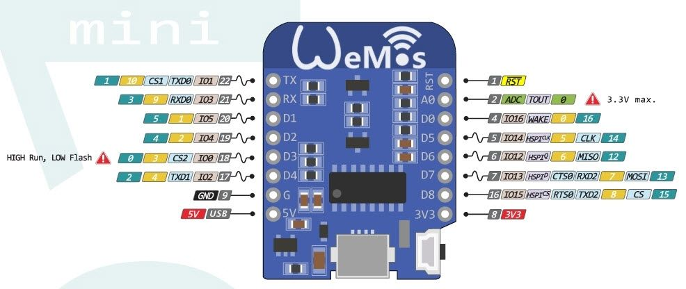

# esp8266-micropython-101
* all most command we demo on mac OS *


## Prerequisite
  - python 3
  - [virtualenvwrappe](http://virtualenvwrapper.readthedocs.io)
  - [CP210x USB to UART Bridge VCP Drivers](http://www.silabs.com/products/development-tools/software/usb-to-uart-bridge-vcp-drivers)
  - firmware [MicroPython downloads page](http://micropython.org/download#esp8266)
## How to Flash firmware micropython to esp8266
1. create virtualenv and activate

    ```
    # mkvirtualenv -p $(which python3) micropython-101
    Running virtualenv with interpreter /Library/Frameworks/Python.framework/Versions/3.4/bin/python3
    Using base prefix '/Library/Frameworks/Python.framework/Versions/3.4'
    New python executable in /Users/montri.s/.virtualenvs/micropython-101/bin/python3
    Also creating executable in /Users/montri.s/.virtualenvs/micropython-101/bin/python
    Installing setuptools, pip, wheel...done.

    # setvirtualenvproject $VIRTUAL_ENV $(pwd)
    ```
2. Deploying the firmware

   ```  
   # pip install esptool

   Collecting esptool
   Using cached esptool-1.3.tar.gz
   Collecting pyserial>=2.5 (from esptool)
   Using cached pyserial-3.3-py2.py3-none-any.whl
   Building wheels for collected packages: esptool
   Running setup.py bdist_wheel for esptool ... done
   Stored in directory: /Users/{youraccout}/Library/Caches/pip/wheels/36/10/52/d64ec3a050fdfb8561af3c52958fe514937bfaa6e1e676f084
   Successfully built esptool
   Installing collected packages: pyserial, esptool
   Successfully installed esptool-1.3 pyserial-3.3
   ```

3. git clone

    ```
    # git clone https://github.com/montri2025/esp8266-micropython-101.git
    ```    
4. connect esp8266 with USB Port And then deploy the new firmware using:
    ```
    # esptool.py --port /dev/tty.wchusbserial1420 --baud 115200 write_flash --flash_size=detect -fm dio 0 firmware/esp8266-20170612-v1.9.1.bin

    esptool.py v1.3
    Connecting....
    Auto-detected Flash size: 32m
    Running Cesanta flasher stub...
    Flash params set to 0x0240
    Wrote 602112 bytes at 0x0 in 51.9 seconds (92.9 kbit/s)...
    Leaving...
    ```

5. MicroPython REPL prompt (screen) Mac you can use the built-in

    ```
    # screen  /dev/tty.wchusbserial1420 115200
    ```
    * When you're done using screen most versions of it allow you to exit by pressing Ctrl-a then k then y or presing Ctrl-a then typing :quit and pressing enter.

    ```
    # picocom /dev/tty.wchusbserial1420 -b115200
    ```
    * if not found command
    ```
    # brew install picocom
    ```
6. Basics Load File and Run code
      ```
      # pip install adafruit-ampy
      Downloading adafruit_ampy-1.0.1-py2.py3-none-any.whl
      Collecting click (from adafruit-ampy)
      Using cached click-6.7-py2.py3-none-any.whl
      Requirement already satisfied: pyserial in /Users/{youraccout}/.virtualenvs/micropython-101/lib/python3.4/site-packages (from adafruit-ampy)
      Installing collected packages: click, adafruit-ampy
      Successfully installed adafruit-ampy-1.0.1 click-6.7
      #  ampy --help

      ampy - Adafruit MicroPython Tool

      Ampy is a tool to control MicroPython boards over a serial connection.
      Using ampy you can manipulate files on the board's internal filesystem and
      even run scripts.

    Options:
      -p, --port PORT  Name of serial port for connected board.  Can optionally
                       specify with AMPY_PORT environemnt variable.  [required]
      -b, --baud BAUD  Baud rate for the serial connection (default 115200).  Can
                       optionally specify with AMPY_BAUD environment variable.
      --version        Show the version and exit.
      --help           Show this message and exit.

    Commands:
      get    Retrieve a file from the board.
      ls     List contents of a directory on the board.
      mkdir  Create a directory on the board.
      put    Put a file or folder and its contents on the...
      reset  Perform soft reset/reboot of the board.
      rm     Remove a file from the board.
      rmdir  Forcefully remove a folder and all its...
      run    Run a script and print its output.
      ```
      6.1. Basics ampy command
        6.1.1 config AMPY_PORT for use default port connect
          ```
          # export AMPY_PORT=/dev/tty.wchusbserial1420
          ```
        6.1.2 Run command
          ```
          # ampy run example/test.py
          ไมโครไพทรอน (micropython) ยินดีต้อนรับ
          xxxx
          ```
          * No output

          ```
          # ampy run -n example/test.py
          ```
        6.1.3 copy file form board to laptop
          ```
          # ampy get boot.py boo.py
          ```
        6.1.4 upload file to board
          ```
          # ampy put example/led_blink/boot.py boot.py
          # ampy put example/led_blink/led_blink.py led_blink.py
          # ampy put example/led_blink/main.py main.py
          ```
          then press reset button
